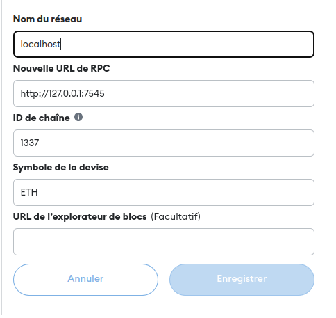
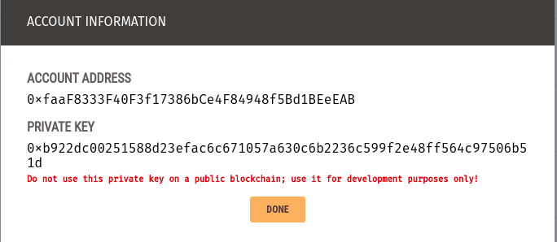
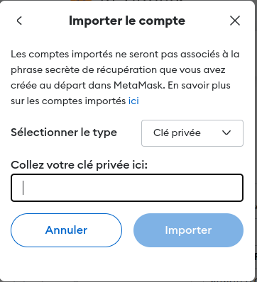
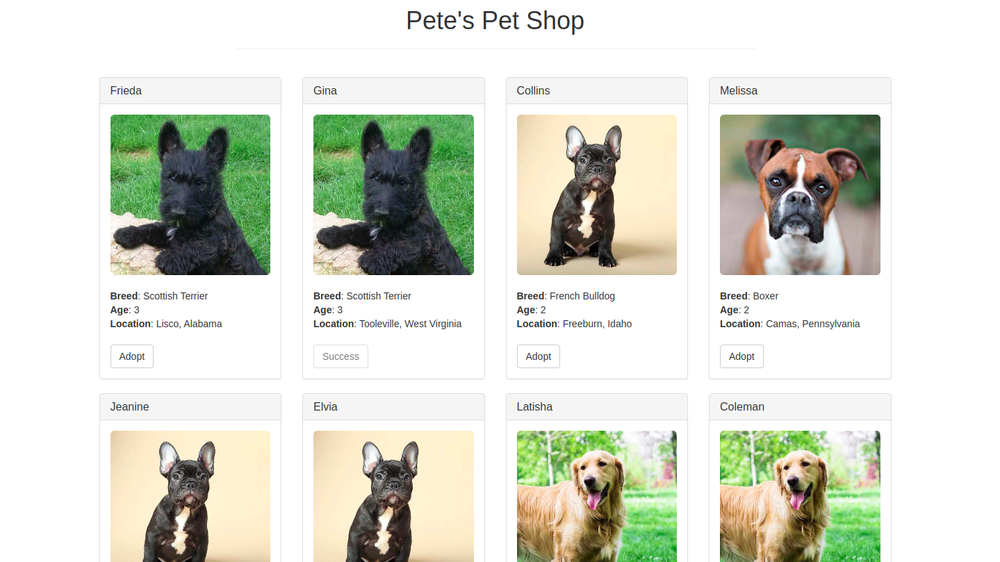
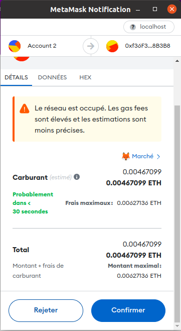

# Pet Shop Blockchain Tutorial

## Introduction
This README guides you through the Pet Shop blockchain tutorial, focusing on Ethereum smart contracts for pet adoption.

## Prerequisites
- Node.js and npm
- Truffle Suite
- Ganache
- MetaMask extension for your browser

## Setup
1. **Install Dependencies**: Run `npm install` to install necessary packages.

2. **Configure Truffle**: Set up your `truffle-config.js` for Ethereum network connectivity.

## Smart Contract Development
### Part 1: Adoption Contract
- **File**: `Adoption.sol`
- **Description**: This contract enables users to adopt a pet.
- **Key Functions**:
  - `adopt`: Function to adopt a pet.
  - `getAdopters`: Function to retrieve all adopters.

### Part 2: Deployment
- **File**: `2_deploy_contracts.js`
- **Description**: Script to deploy the Adoption contract.

## Setting up Ganache
In order to test contracts deployment and develop dapp applications and run tests we need to have a blockchain running hence we'll be using Ganache, a personal blockchain for Ethereum development.
## Setting Up MetaMask
1. **Install MetaMask**: Add the MetaMask extension to your browser.
2. **Link MetaMask to Ganache**: 

    * Create an account 
    * Create a new network 
    
    * Import an account using one of the private keys offered by Ganache
    
    

## Starting the Server
1. **Command**: Run `npm run dev` to start the local server.
2. **Access**: Open `http://localhost:3000` in your browser.

 

## Making a Transaction
1. **Adopt a Pet**: Click on the adopt button under a pet.
2. **MetaMask Prompt**: Confirm the transaction in MetaMask.

 

## Conclusion
This tutorial demonstrates the basics of Ethereum smart contracts and DApp development.
